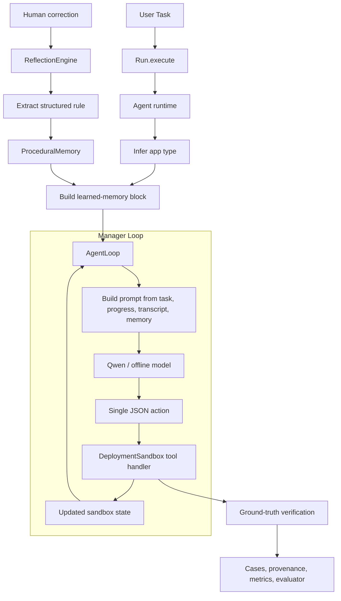
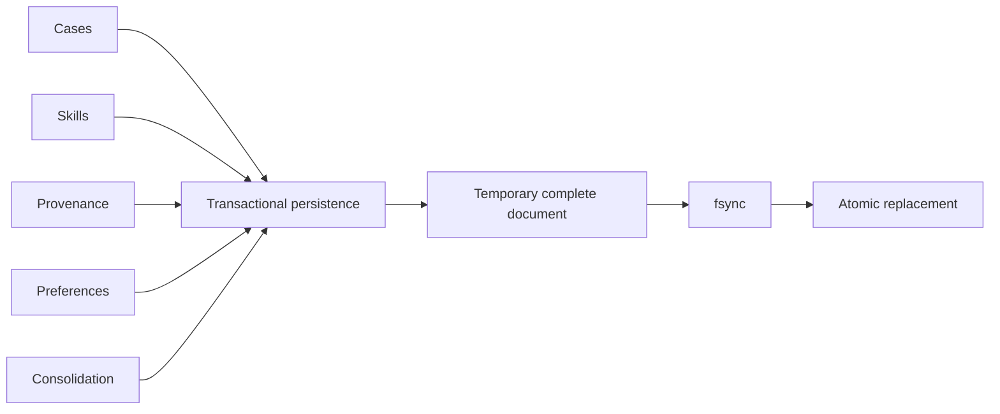
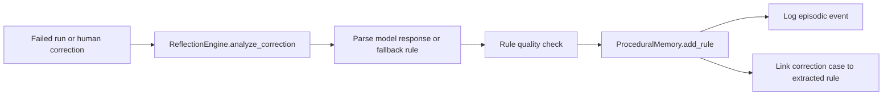

# Architecture

## Run path

Sage runs a tool-using model loop backed by persistent memory.

The runtime path is:

1. Receive a deployment task.
2. Infer the app type.
3. Build a focused learned-memory block.
4. Run the manager loop one action at a time.
5. Execute actions against a stateful deployment sandbox.
6. Verify the result against ground truth.
7. Persist the run as a case and update provenance, metrics, and evaluator data.

When a task fails and a human supplies a correction, the reflection engine extracts a reusable rule and stores it in procedural memory for later runs.

## Runtime Flow

## Runtime modules

| Module | Responsibility |
|---|---|
| `Run` | Correlates a Run and records its execution path |
| `Agent` | Assembles runtime dependencies and handles Corrections |
| `AgentLoop` | Runs the observe -> decide -> act loop (`run_loop()`) |
| `DeploymentSandbox` | Holds the true deployment state and required port rules by app type |
| `MemorySystem` | Reads memory, changes Rules, and runs maintenance |
| `MemoryRetrieval` | Ranks memory across stores for the Prompt Compiler |
| `PromptBlockCompiler` | Compiles memory blocks into focused prompt context |
| `ReflectionEngine` | Turns corrections into structured rules |
| `ModelCaller` | Wraps Qwen Cloud calls with retry, circuit breaker, rate limiting, and usage tracking |
| `MCPClient` | Talks to Alibaba Cloud through MCP or a local simulator |
| `JobManager` | Manages long-running Runs with idempotent job API, cancellation, and budgets |
| `Persistence` | Atomic file-backed writes (JSON and JSONL) with fsync and locking |
| `CloseableMixin` | Shared lifecycle (`__del__`, context manager) for resource-holding classes |
| `JsonDocumentCollection` | Shared `get_all()` / `clear()` for memory stores backed by atomic documents |

## Memory Components

| Memory | Role in the System |
|---|---|
| Procedural | Learned rules injected back into future prompts |
| Episodic | Raw interaction history and corrections |
| Semantic | Background knowledge and learned facts |
| Cases | Structured execution trajectories |
| Skills | Reusable successful trajectories |
| Provenance | Evidence graph connecting rules and later outcomes |
| Preferences | Durable user and environment preferences |
| Session | Cross-session continuity |
| SQLite store | Structured persistence for reporting and later queries |

### File-backed updates

File-backed stores share the transaction code in `persistence.py`. Callers use
`read`, `update`, and `clear`; the module handles parsing, validation, locking,
temporary files, `fsync`, and atomic replacement. Stores that only need
`get_all()` / `clear()` over a single document inherit from
`JsonDocumentCollection` to avoid duplicated delegation.

Transactions are process-wide and shared by resolved path. A multi-process or
multi-host deployment must move mutable state to SQLite or another adapter with
cross-process transaction guarantees; see ADR-0006.

## Current Runtime Note

The system contains broader retrieval and memory infrastructure than the current live prompt compiler uses.

The active manager loop currently injects a focused learned-memory block built from:

- organisation facts (task-type defaults and conventions)
- preference context
- runbook rules (learned procedural rules)
- relevant skill (best-matching skill trajectory)
- similar case (most similar past execution)

Other memory tiers are still persisted and used for:

- run recording
- provenance
- evaluator output
- counterfactual analysis
- maintenance and consolidation
- retrieval experiments and future prompt-compilation work

## Reflection Path

## Verification Model

Sage does not treat tool success as deployment success.

`DeploymentSandbox` checks whether:

- an instance exists
- the app was deployed
- the required application port is actually open

App-type conventions are encoded in the sandbox:

- `node`, `python`, `java` -> `8080`
- `docker`, `static` -> `80`

That gives Sage a stable ground truth for learning and counterfactual evaluation.

## Qwen and Alibaba Cloud Usage

| Service | Purpose |
|---|---|
| Qwen `qwen-max` | Reflection and higher-quality rule extraction |
| Qwen `qwen-turbo` | Execution-time tool decision loop |
| Qwen `qwen-plus` | Reserved task type for planning-style calls |
| Qwen embeddings | Semantic retrieval in memory modules |
| Alibaba Cloud MCP | ECS and security-group operations in connected mode |

The HTTP API is fail-closed: every non-health route requires the configured
administration token (`X-Sage-Admin-Token` header) and a browser-session
identifier (`X-Sage-Session-ID` header), enforced by the `require_auth`
decorator in `api.py`. Live Qwen access also requires `SAGE_ENABLE_LIVE=true`;
real Alibaba mutations additionally require session-scoped credentials and
`SAGE_ALLOW_CLOUD_MUTATIONS=true`. Missing real cloud prerequisites are errors
and never cause a silent simulation fallback.

Long-running Runs use an idempotent job API. Each Run has provider-attempt,
token, and wall-clock budgets plus cooperative cancellation. Offline, Qwen
Sandbox, and real Cloud results carry explicit execution provenance.

## Observability Surfaces

Sage exposes several debugging and inspection surfaces:

- per-step execution traces in the Streamlit UI
- token usage from `ModelCaller`
- provenance graph as Mermaid
- evaluator metrics and counterfactual comparisons
- memory-state dumps through the CLI and UI
